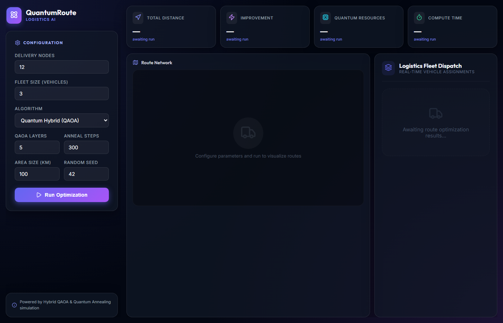

# Quantum Route Optimization (Hybrid Quantum-Classical Logistics)

[](https://quantum-route-pyce.onrender.com)
[](https://github.com/Pradeep007-pixel/Quantum_Route_Optimization)

**Author:** [Althi Pradeep Kumar](https://github.com/Pradeep007-pixel) — sole developer and maintainer.

A comprehensive, full-stack vehicle route optimization engine that leverages hybrid quantum-classical algorithms to solve the NP-hard Vehicle Routing Problem (VRP) in real-time. This framework combines high-performance simulated quantum computing with an interactive, high-fidelity React dashboard to deliver maximum fleet efficiency.

## 📸 Preview



**Links:** [Live Demo](https://quantum-route-pyce.onrender.com) · [Repository](https://github.com/Pradeep007-pixel/Quantum_Route_Optimization)

## 🚀 Key Features

*   **Hybrid Quantum Optimization:** Integrates the Quantum Approximate Optimization Algorithm (QAOA) formulation with simulated Quantum Annealing (SQA) featuring quantum tunneling probability.
*   **Geospatial Dispatch Visualization:** A custom HTML5 Canvas rendering engine representing vehicle paths, deliveries, and depot connections with high-performance CSS and canvas effects.
*   **Automated QUBO Compiler:** Formulates multi-vehicle VRP constraints (each node visited once, capacity limits) into a normalized Quadratic Unconstrained Binary Optimization (QUBO) matrix.
*   **Real-time Metrics & Comparison:** Instantly calculates path efficiency improvements, quantum vs. classical distance comparison, qubit allocation, and QAOA circuit depth.
*   **Dynamic Constraint Controls:** Fully configurable environment parameters, including node size, fleet capacity, QAOA layer count ($p$), annealing steps, and seed controls.

## 🛠️ Tech Stack

*   **Backend:** Python 3.8+ (FastAPI, Uvicorn)
*   **Frontend:** React (Vite), Axios, Lucide Icons, Recharts, Custom Canvas API
*   **Quantum Core:** NumPy, custom QUBO compiler, Simulated Quantum Annealing engine with dynamic tunneling boost.

## 📦 Installation

1.  **Clone the Repository:**
    ```bash
    git clone https://github.com/Pradeep007-pixel/Quantum_Route_Optimization.git
    cd Quantum_Route_Optimization
    ```

2.  **Set Up the Backend:**
    Install the Python packages:
    ```bash
    pip install -r requirements.txt
    ```

3.  **Set Up the Frontend:**
    Navigate to the frontend folder and install npm packages:
    ```bash
    cd frontend
    npm install
    ```
    Then, build the frontend application:
    ```bash
    npm run build
    ```

## 🖥️ Usage

### Quick Start (Recommended)
Run the automated launcher script from the root directory to spin up the FastAPI backend and serve the compiled React frontend automatically:
```bash
run.bat
```
Your default web browser will automatically open to `http://localhost:8000`.

### Manual Start
1.  **Start Backend:**
    ```bash
    python main.py
    ```
2.  **Start Frontend Dev Server:**
    ```bash
    cd frontend
    npm run dev
    ```

## 📊 Quantum Methodology

The framework compiles the Vehicle Routing Problem into a Quadratic Unconstrained Binary Optimization (QUBO) model:

$$\min_{x} x^T Q x$$

Where the binary decision variable $x_{i, k} = 1$ if node $i$ is assigned to vehicle $k$. The QUBO formulation integrates:
1.  **Path Minimization:** Linear costs based on the Euclidean distance matrix.
2.  **Visit Constraints:** Penalty terms enforcing that every delivery node is serviced exactly once.
3.  **Capacity Constraints:** Penalty terms scaled by vehicle cargo limitations.

The Simulated Quantum Annealing (SQA) engine incorporates a **quantum tunneling factor** that decreases as the system cools down. This allows the solver to tunnel through energy barriers and escape local minima where traditional classical heuristics get stuck.

## 🌐 Publish Online

To put a **live demo** on the internet (free hosting) and use the URL on your resume, follow **[DEPLOY.md](DEPLOY.md)**.

Quick path: push to GitHub → connect the repo on [Render](https://render.com) with the included `render.yaml` → share your `*.onrender.com` link.

## 📜 License

MIT License — Copyright © 2026 **Althi Pradeep Kumar**. See [LICENSE](LICENSE).

## ⚠️ Disclaimer

This application is intended for research, optimization benchmarks, and academic purposes. The quantum execution is simulated on classical hardware.